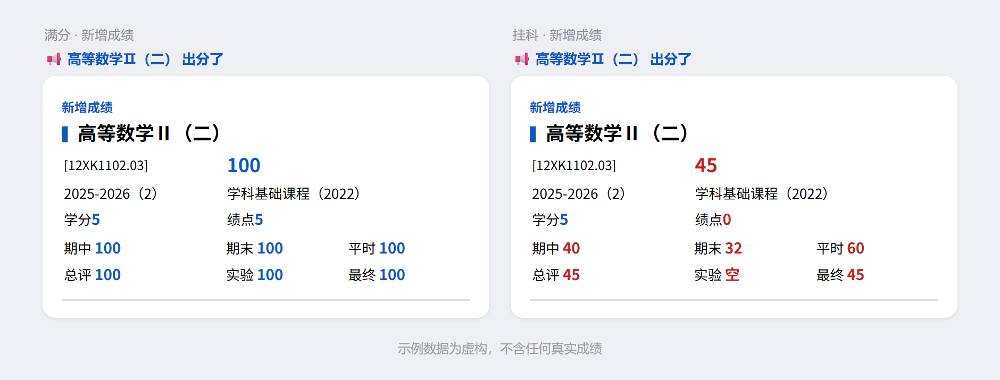

# JWGrade

长安大学成绩自动监控工具。

它会定时检查教务系统成绩页面，发现成绩更新后，通过 PushPlus 推送到微信。

> 当前版本：`0.1.0-alpha.1`，适合个人自部署使用。

## 推送效果

左侧为正常成绩通知，右侧为不及格成绩通知；异常分数、绩点和相关明细会标红显示。
图里的数据是虚构的，用 `tools/demo_push.py` 生成，不含任何真实成绩。

如果不需要完整明细，可以把 `notify.detail_level` 改为 `brief`。
此时只会推送课程名称和最终成绩，发送给 PushPlus 的内容也会相应减少。

## 功能

- 自动检查成绩更新；
- 支持新增、变更、撤回和重新发布；
- 成绩变化推送到微信；
- 保存成绩快照和变更历史；
- 推送失败后自动补发；
- 复用登录会话，减少重复登录；
- 支持 Linux 常驻运行。

## 仓库结构

| 名称 | 用途 |
|---|---|
| [`.github/`](.github/) | GitHub Issue 模板等仓库配置。普通用户部署时不需要修改。 |
| [`deploy/`](deploy/) | 云服务器部署脚本，负责安装依赖、生成配置和注册系统服务。 |
| [`docs/`](docs/) | 新用户部署指南、日常维护说明和推送效果图片。 |
| [`src/`](src/) | 程序核心代码，包括登录、成绩抓取、变化比对、定时检查和消息推送。 |
| [`tools/`](tools/) | 推送测试工具，用于检查 PushPlus 通道和手机页面显示效果。 |
| [`.gitattributes`](.gitattributes) | 规定仓库文件的换行格式，避免 Shell 脚本在 Linux 上因行尾格式出错。 |
| [`.gitignore`](.gitignore) | 指定不上传到 GitHub 的本地文件，例如密码配置、成绩快照、Cookie 和日志。 |
| [`CHANGELOG.md`](CHANGELOG.md) | 记录各版本包含的功能、修改内容和已知限制。 |
| [`config.example.yaml`](config.example.yaml) | 配置文件模板。部署脚本会根据它生成实际使用的 `config.yaml`。 |
| [`LICENSE`](LICENSE) | 项目许可证，说明允许和禁止的使用方式。 |
| [`README.md`](README.md) | 项目首页，介绍功能、仓库结构、使用入口和注意事项。 |
| [`requirements.txt`](requirements.txt) | 项目直接使用的 Python 依赖及其版本。 |
| [`requirements.lock.txt`](requirements.lock.txt) | Linux 部署使用的完整依赖版本清单，部署脚本会优先安装它。 |
| [`SECURITY.md`](SECURITY.md) | 安全使用说明，以及发现安全问题后的报告方式。 |

## 开始使用

这是一个需要自行部署的 Linux 服务，只使用你本人的账号，并运行在你自己的服务器上。

**需要 Python 3.10+**——Ubuntu 22.04 及以上或 Debian 12 及以上都自带，Ubuntu 20.04（3.8）和 Debian 11（3.9）不行。

第一次部署请完整阅读 **[`docs/deployment.md`](docs/deployment.md)**，README 不重复展开部署命令。

部署完成后，查看状态、调整轮询频率、更新教务密码、停止服务或迁移服务器等操作，请阅读 **[`docs/operations.md`](docs/operations.md)**。

## 注意事项

- 本项目仅供个人使用，不要用它保存或处理他人的学号、密码、Cookie 或成绩；
- 不要把 `config.yaml`、`data/`、日志、Cookie、成绩快照或 PushPlus token 上传到 GitHub；
- 不要为了检查状态反复重启服务；服务恢复会话失败时，重启可能触发重新认证；
- 学校教务系统页面或访问方式变化后，程序可能需要维护。

## 许可证

本项目使用自定义的 [`JWGrade Personal Use License 1.0`](LICENSE)：
**允许**个人学习、研究和用本人账号自部署；**禁止**商业用途、替他人代查或托管账号、以及重新分发。

这不是 OSI 认证的开源许可证，GitHub 可能将其显示为 Other。
程序按「现状」提供，不保证可用性、送达率或数据完整性，使用产生的后果由使用者自行承担。
